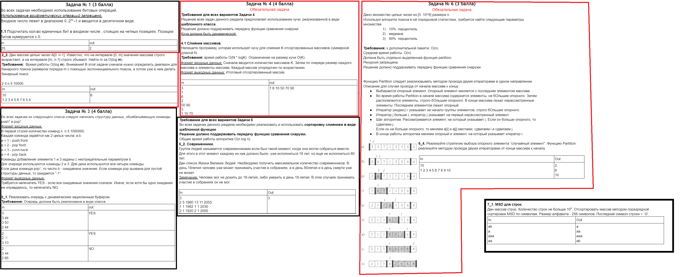

# algos_hw
ДЗ по курсу Алгоритмы (второй модуль)  
Задача 1 Вар 1  
Задача 2 Вар 2  
Задача 3 Вар 1  
Задача 4 Вар 1  
Задача 5 Вар 2  
Задача 6 Вар 4  
Задача 7 Вар 1  
  
перейдите в папку с дз  
далее вызовите  
```g++ main.cc -o hw```  
```./hw```